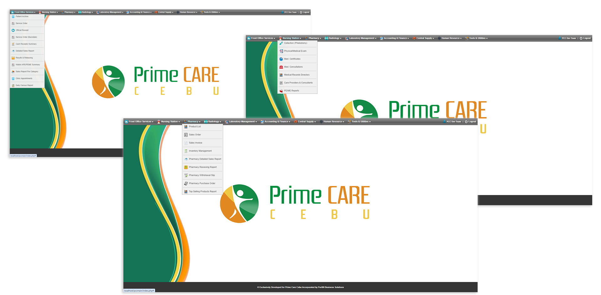
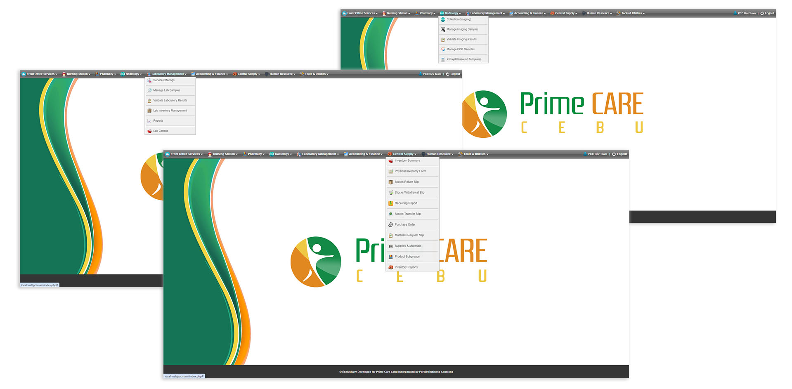
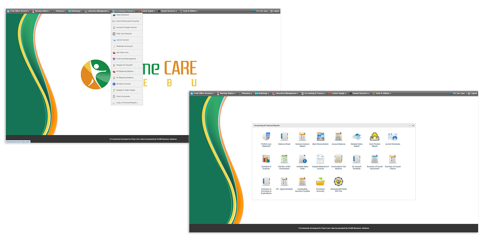
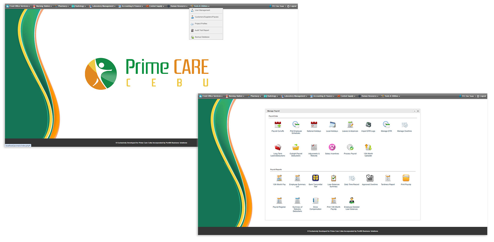

# Prime Care Cebu - ERP System

   

# Introduction

The Prime Care Cebu ERP System is a comprehensive, integrated enterprise resource planning platform designed specifically for healthcare and medical institutions. Developed exclusively for Prime Care Cebu by Port80 Business Solutions.

# Screenshots

#

#

#

# Requirements
+ WAMP Server 2.5
+ Apache 2.4.9
+ PHP 5.5.12 and above
+ MySQL 5.6.17
+ SQLyog Ultimate 5.5.5.0 and above

# Package Inclusion

This system streamlines and automates key operational workflows across various hospital departments, including:

+ <b>Front Office Services:</b> Patient management, service orders, receipts, and sales reports

+ <b>Nursing Station:</b> Clinical and nursing operations support

+ <b>Pharmacy:</b> Medication inventory and dispensing processes

+ <b>Radiology & Laboratory Management:</b> Diagnostic records and reporting

+ <b>Accounting & Finance: </b> Financial reporting, cash receipts, and detailed sales summaries

+ <b>Central Supply: </b> Supply chain and inventory control

+ <b>Human Resources: </b> Staff records and HR management

+ <b>Tools & Utilities: </b> System maintenance and configuration tools
   

